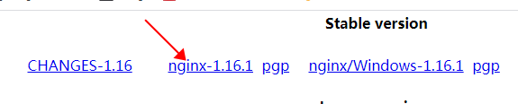
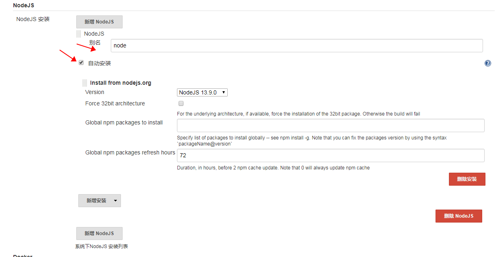
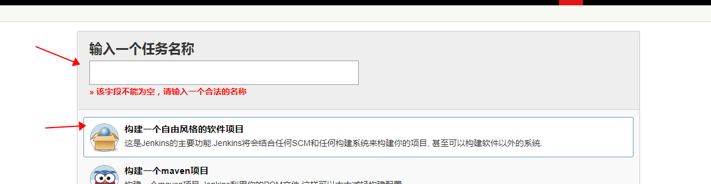
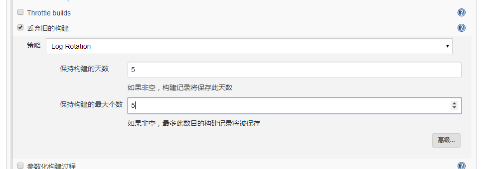
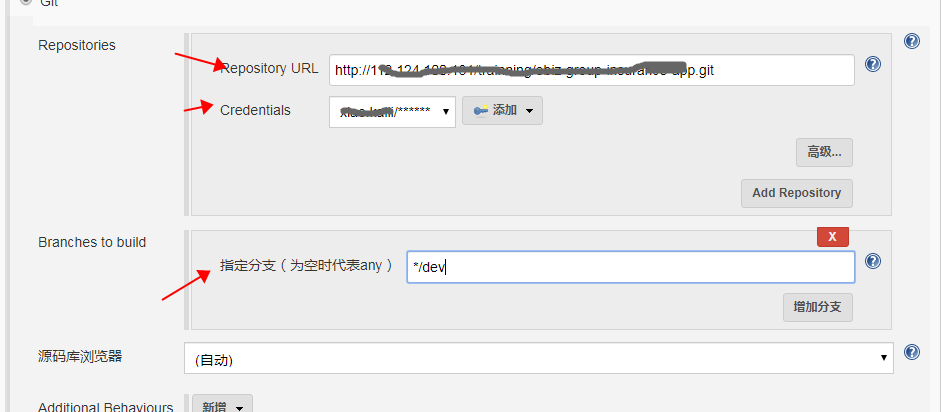
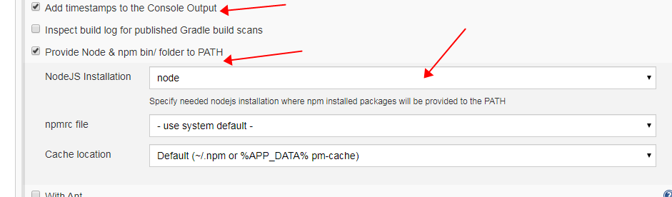
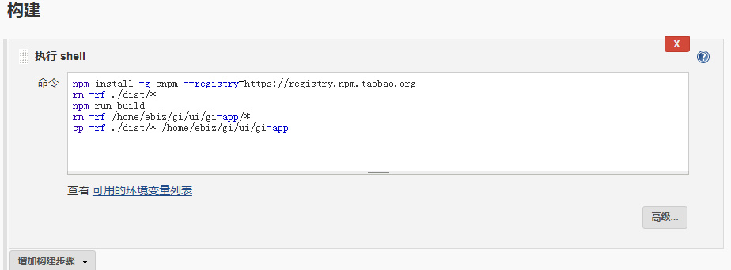
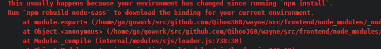
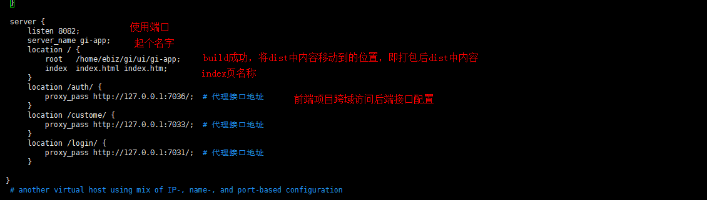

# 使用jenkins发布Vue项目

* ## 环境准备

  > 1.jenkins环境安装配置见[jenkins安装配置及发布SpringBoot项目](./assets/jenkins安装及发布SpringBoot项目.md)文档中的前半部分
  >
  > 2.Vue项目使用Vue cli创建，build成功后使用nginx代理发布，所以需要安装nginx

  **安装nginx**

  1. nginx官网下载 [下载地址](http://nginx.org/en/download.html)

      

     pcre 官网下载[下载地址](https://ftp.pcre.org/pub/pcre/)

  2. 安装

     1.通过root用户登录，准备nginx安装的相关环境，执行

     `yum -y install make zlib zlib-devel gcc-c++ libtool  openssl openssl-devel`

     2.解压pcre，进入pcre解压后的目录，依次运行下列命令，prefix后是指定安装路径

      ```  shell
     cd /opt
     tar -zxvf pcre-8.35.tar.gz
     cd /pcre-8.35
     ./configure --prefix=/opt/admin/pcre
     make
     make install
     #检查是否安装成功
     pcre-config --version
      ```

     3.解压nginx并安装,with-prefix后面的路径为pcre的源码路径

     ```
     cd /opt
     tar -zxvf nginx-1.16.1.tar.gz
     cd /nginx-1.16.1
     ./configure --prefix=/opt/admin/nginx --with-http_stub_status_module --with-http_ssl_module --with-pcre=/opt/admin/pcre-8.35
     make
     make install
     ```

* ## jenkins发布Vue项目

  **1. 安装nodejs插件**

  ​	可选插件搜索 NodeJS Plugin安装

  **2. 配置nodejs插件**

  ​	配置管理->全局工具配置->新增NodeJS

   

  

  **3. 新建任务**

    1.选择自由风格，起名

   2.选择丢弃旧的构建

  3.配置项目git地址，如果第一次使用git需要点击添加配置用户名，密码并下拉选择

  

  4.构建环境中选择添加时间输出，选择node环境，默认展示我们配置的node

  

  5.构建选择执行shell脚本并输入命令，构建并引动构建结果到指定位置

  ```shell
  npm install -g cnpm --registry=https://registry.npm.taobao.org
  rm -rf ./dist/*
  npm run build
  rm -rf /home/ebiz/gi/ui/gi-app/*
  cp -rf ./dist/* /home/ebiz/gi/ui/gi-app
  ```

  

  

  

  > 遇到的问题：

   1.开始使用npm install安装特别慢，改为用cnpm 

  ​	npm install -g cnpm --registry=https://registry.npm.taobao.org

   2.修改后提示报错 

   这是由于上次使用npm install导致环境变化引起的，需要按照提示运行npm rebuild node-sass

   将命令添加到shell最上方，执行成功；**注意下次要把这句删掉**

  **4.配置nginx**

  * 项目打包后放在了指定位置，我们使用nginx来发布；

  * 修改nginx安装目录的配置文件（即上面的/opt/admin/nginx），这里一定要注意不是修改压缩包里的配置文件

  * 打开目录中conf下的nginx.xml,修改server如下，如果有多个前端项目，配置多个server即可

    

  ```shell
   server {
          listen 8082;            
          server_name gi-app;
          location / {
              root   /home/ebiz/gi/ui/gi-app;  
              index  index.html index.htm;
          }
          location /auth/ {
              proxy_pass http://127.0.0.1:7036/;  # 代理接口地址
          }
          location /custome/ {
              proxy_pass http://127.0.0.1:7033/;  # 代理接口地址
          }
          location /login/ {
              proxy_pass http://127.0.0.1:7031/;  # 代理接口地址
          }
  
     }
  ```

  

   

  * 启动nginx，切换到sbin下运行

    ./nginx  启动

    ./nginx  -s reload 重启