#  jenkins安装配置及发布Springboot项目全过程

* ## 环境准备

  > 服务器系统环境是centos7，jenkins发布项目过程中需要用到jdk，maven，git，需要在linux系统上提前安装

  **1.安装jdk1.8**

   1. 官网下载压缩包版(xxx.tar.gz)，这里根据自己系统选择合适的版本，[下载地址](https://www.oracle.com/java/technologies/javase-jdk8-downloads.html)

   2. 上传到服务器（推荐工具FileZilla）

      > Tips:可以将软件或者运行包都放在服务器上同一目录下，方便维护 例如 /opt/xxx/...

  3. 解压

  ​     `tar -zxvf jdk-8u131-linux-x64.tar.gz`

  4. 配置环境变量并刷新

     `vim ~/.bashrc`

     配置内容：

     ```shell
     export JAVA_HOME=实际的地址
     export CLASSPATH=$JAVA_HOME/lib:$CLASSPATH
     export PATH=$JAVA_HOME/bin:$PATH
     ```

     刷新：

     `source  ~/.bashrc`

  5. 验证是否配置成功,输入java -version

  ​      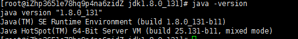

  

  **2.安装maven**

  1. 官网下载压缩包版(xxx-bin.tar.gz)，[下载地址](http://maven.apache.org/download.cgi)

  2. 上传到服务器

  3. 解压

     `tar -zxvf apache-maven-3.6.1-bin.tar.gz`

  4. 配置环境变量并刷新

     `vim ~/.bashrc`

     在文件中加入MAVEN_HOME配置，并修改PATH加上maven配置

     ```
     export MAVEN_HOME=/opt/apache-maven-3.6.1
     export PATH=$MAVEN_HOME/bin:$JAVA_HOME/bin:$PATH
     ```

     刷新

     `source ~/.bashrc`

  5. 验证是否配置成功，输入mvn -version

     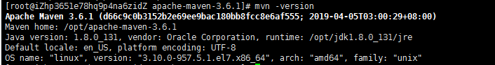

  **3.安装git**

  1. 命令安装

     `yum install git`

  2. 验证是否安装成功，输入git --version

      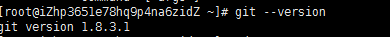

  

* ## jenkins安装及初始化配置

  **1.官网下载长期支持版中 .war包 [下载地址](https://jenkins.io/zh/download/)**

  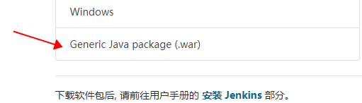

  **2.上传到服务器**

  **3.启动jenkins**

  ​	`nohup java -jar jenkins.war --httpPort=8080 &`

  > Tips: nohup 表示不挂断运行，&表示后台运行；不指定端口默认启动8080

  **4.修改配置文件中下载源地址**

  ​    jenkins初始化安装插件的时候默认访问的外网地址，由于墙的原因会导致慢以及下载失败，很多文档提到在jenkins页面上修改源地址配置经常会不起效，这里直接改配置文件中地址，效果立见。

     配置文件位置在 /root/.jenkins/updates/default.json （配置文件启动后才会生成，所以前面要先启动）

     分别输入下列3条命令,将下载地址改成国内的清华源 ，并将google访问改为百度：

   ```shell
  cd /root/.jenkins/updates
  sed -i 's/http:\/\/updates.jenkins-ci.org\/download/https:\/\/mirrors.tuna.tsinghua.edu.cn\/jenkins/g' default.json
  sed -i 's/http:\/\/www.google.com/https:\/\/www.baidu.com/g' default.json
   ```

  > Tips:  **sed -i 's/查找的字符串/替换的字符串/g' 文件**  查找替换文件中出现的所有字符串

  **5.重新启动jenkins**

  1. 查看启动进程，输入netstat -tunlp

     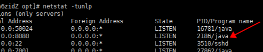

     

  2. 杀掉jenkins启动的8080端口对应的进程

     `kill -9 2186`

  3. 重新启动

  ​	`nohup java -jar jenkins.war --httpPort=8080 &`

  

  **6. 启动成功，浏览器访问服务器jenkins地址（http://ip:8080）**

   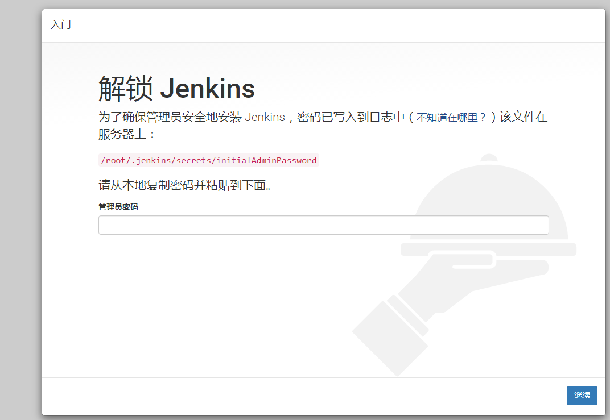

   复制地址，服务器输入cat查看密码，粘贴过来点击继续

   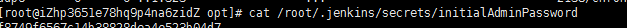

  ​	

  **7.选择推荐安装插件，下一步**

   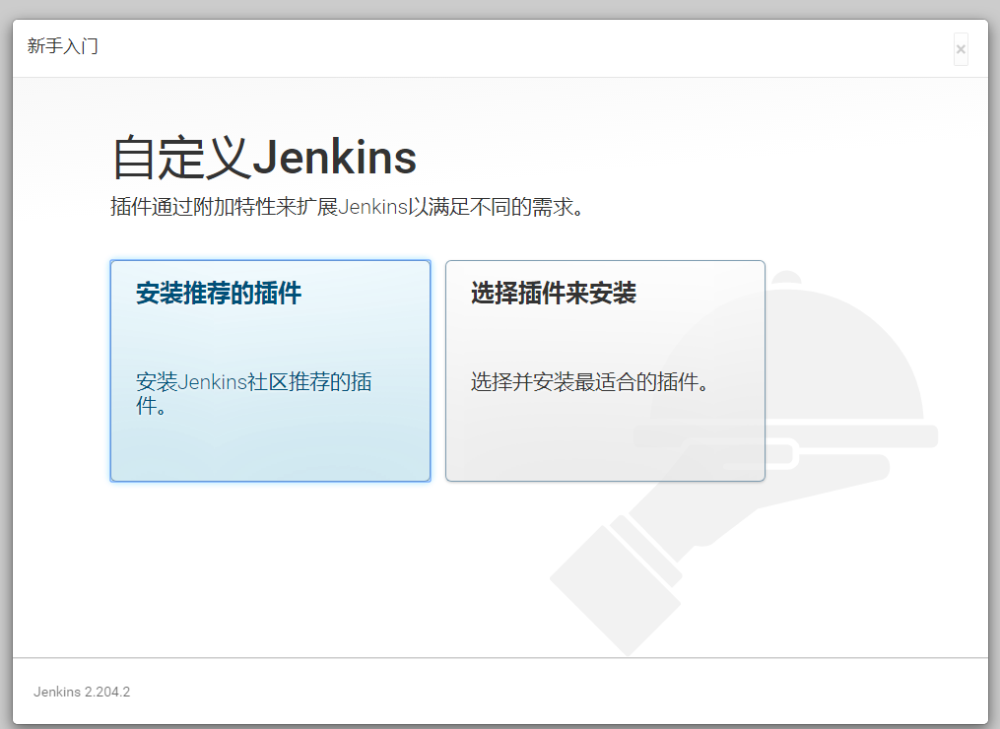

  

  **8.安装成功跳转到创建账号页面,创建账户**

   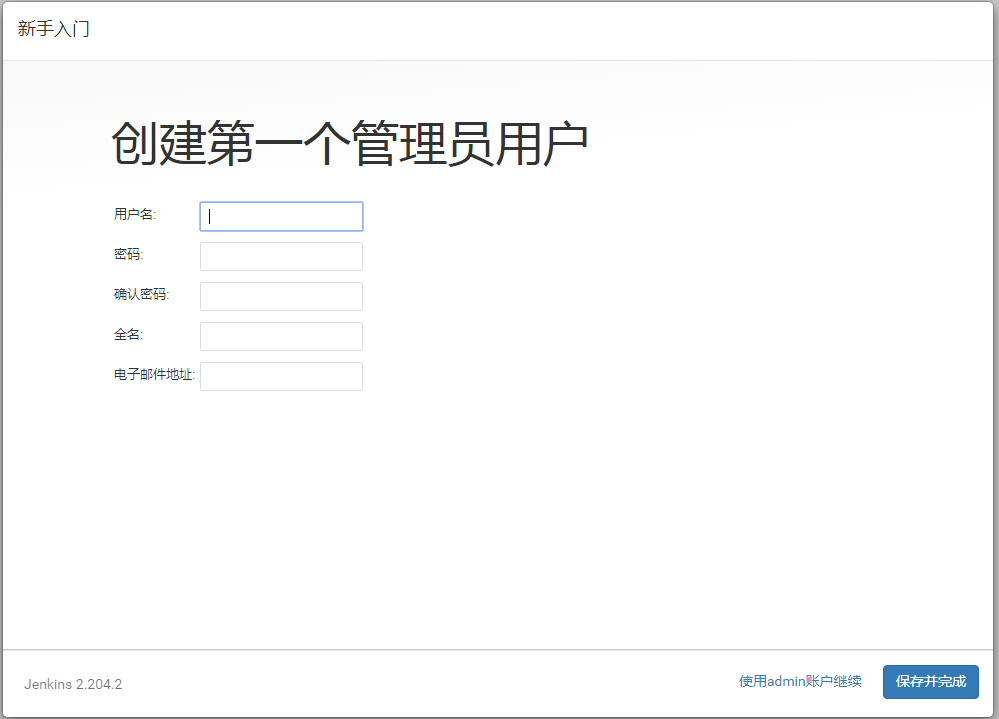

  **9.下一步展示实例配置，直接保存并完成就可以**

   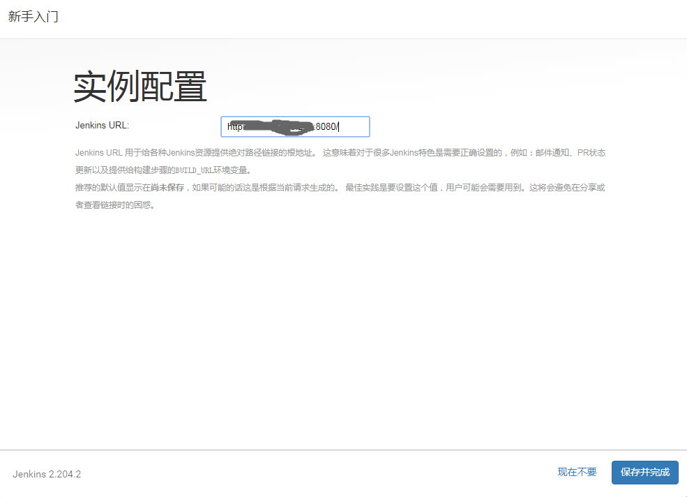

  **10.安装maven插件**

     点击【新建Item】，里面没有构建maven项目的选项，需要安装插件

  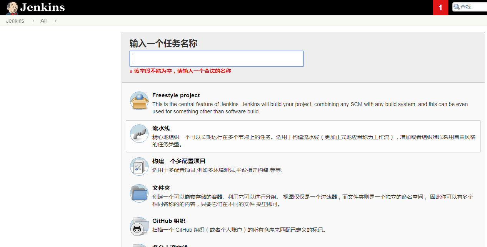

    

   点击【Manage Jenkins】->【Manage Plugins】 ->【可选插件】 搜索 maven integration 直接安装

  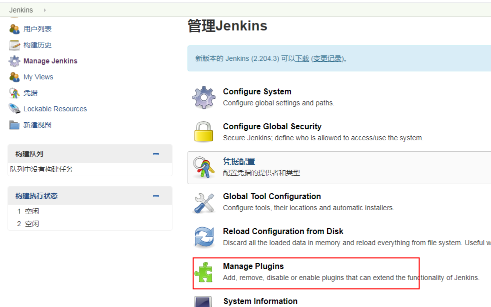

  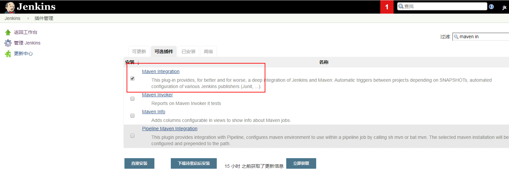

    

  再回到新建任务页面已经有构建maven项目的选项了

  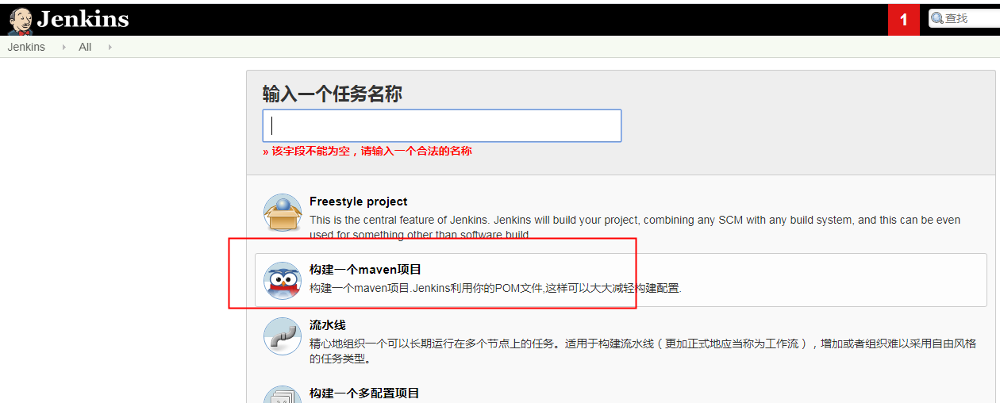

  **11.jenkins配置jdk，git，maven**

     点击【Manage Jenkins】->【Global Tool Configuration】

    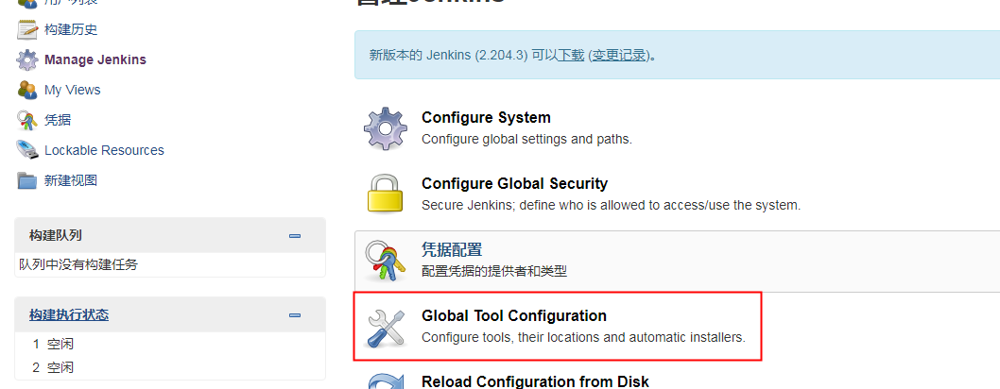

  

  配置jdk，点击新增，注意把下面的自动安装选项给去掉，配置上服务器对应的地址

  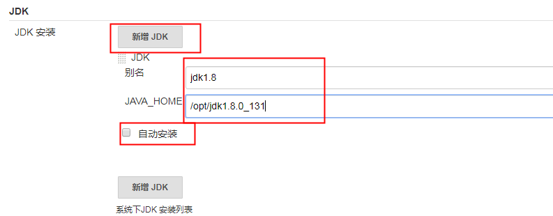

  

  配置maven

  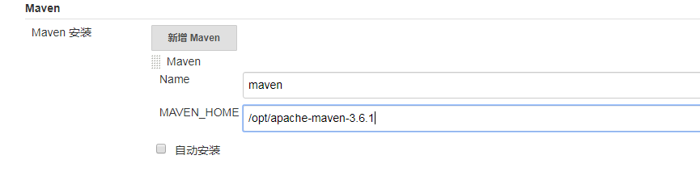

  

  配置git,不清楚git位置的可以输入命令查看： whereis git

  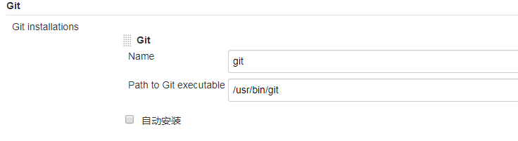

  

* ## jenkins发布SpringBoot项目

  **1. 新建Item输入名称，选择构建一个maven项目**

  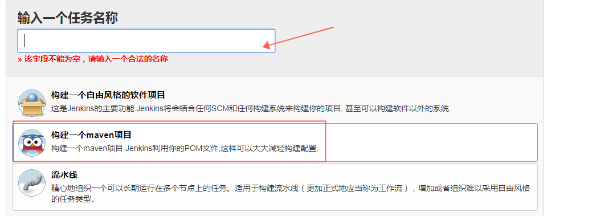

  **2. 配置General中丢弃旧的构建**

  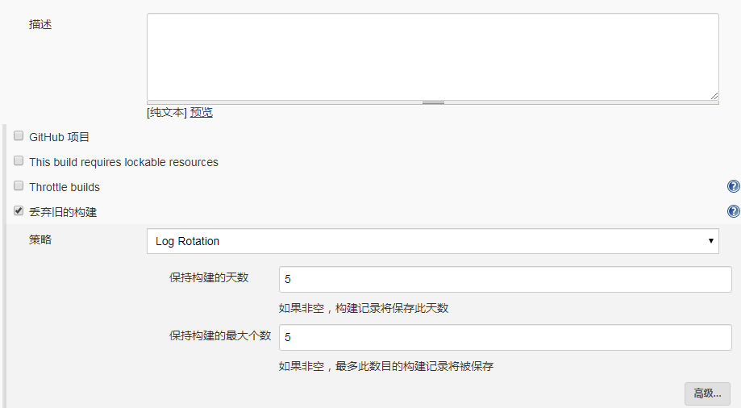

  **3. 配置git地址，这里用http开头的地址，点击添加按钮配置用户名密码并下拉选择**

  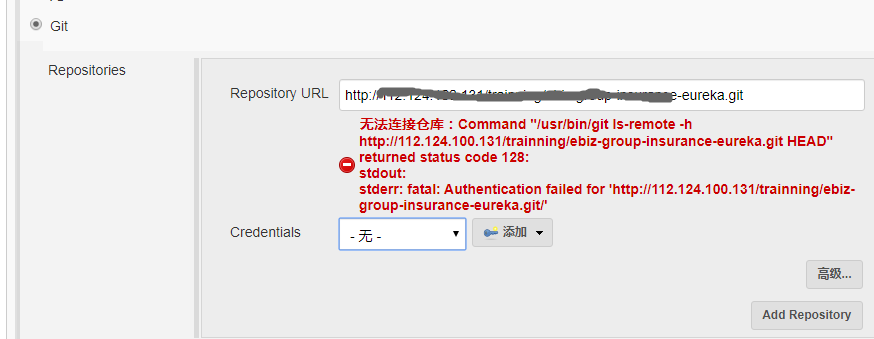

  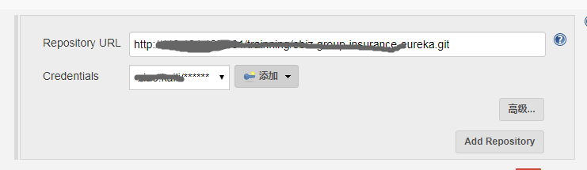

  **4.配置构建环境，添加时间到输出**

  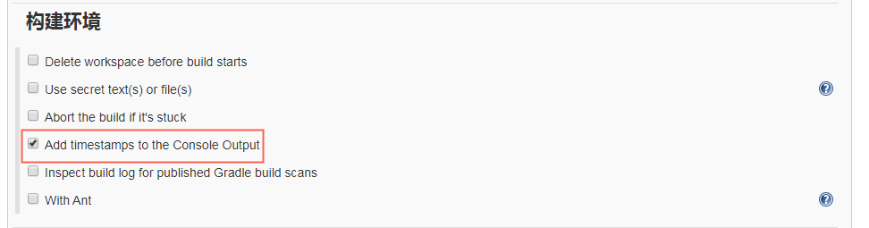

  **5.配置Build，运行maven命令**

  > Tips:Root POM 默认是pom.xml,即pom.xml就是顶级模块下，我这里要运行的pom在项目打开里的center模块下，所以这么配置

  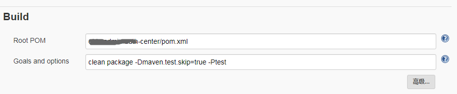

  **6.配置Post Setps，选择构建成功后运行，添加步骤选择执行shell，输入命令**

  > cd 切换到服务器脚本位置
  >
  > sh 脚本名称 参数1 参数2 
  >
  > 参数1： 为jar包名称，这里我的jenkins创建项目名称和jar包名称一致
  >
  > 参数2：我的项目在顶级菜单下的二级菜单中，参数二是该菜单名称
  >
  > 传参数的目的：为了多个项目共用这一个脚本
  >
  > * **重要：大家需要根据自己实际情况传参以及去修改脚本**

     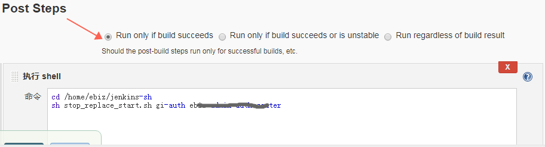

    stop_replace_start.sh 内容如下

  ```shell
  #!/bin/bash
  #以参数的形式处理，这样该脚本可用于发布多个项目
  #停止应用
  pid =`ps -ef|grep "$1.jar"|grep -v "grep"|awk '{print $2}'`
  if [-n "$pid"]
  then
          kill -9 $pid
          echo "杀死应用对应进程"
  fi
  #将上次构建的jar包备份
  file = "/home/ebiz/gi/$1.jar"
  if [-f "$file"]
  then
          mv $file $file.`date+%Y%m%d%H%M%S`
          echo "备份上一次构建"
  fi
  #将新构建的jar包移动过来
  echo "移动本次构建到运行文件夹"
  mv /root/.jenkins/workspace/$1/$2/target/$1.jar /home/ebiz/gi/$1.jar
  #运行jar包
  echo "启动"
  BUILD_ID=dontKillMe
  nohup java -jar /home/ebiz/gi/$1.jar &
  
  ```

  **7.点击应用保存**

  如果遇到下面问题，将安全配置中的禁止跨站点访问对勾给去掉。

  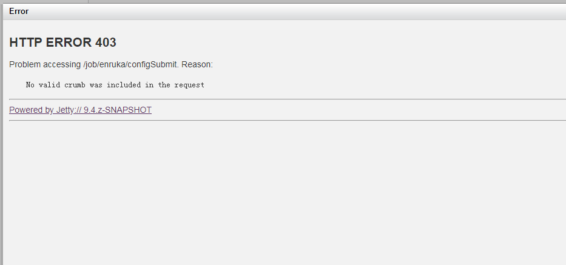

  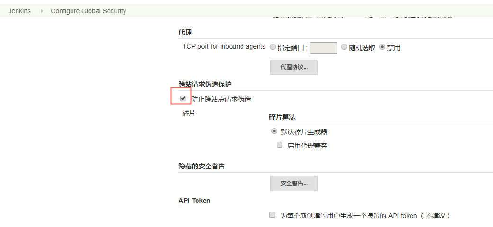

  > **Tips:如果本地有配置maven的settings.xml文件（例如私服配置等），需要将settings上传到服务器替换服务器maven的settings.xml文件**

  

  **8. 点击构建并查看日志**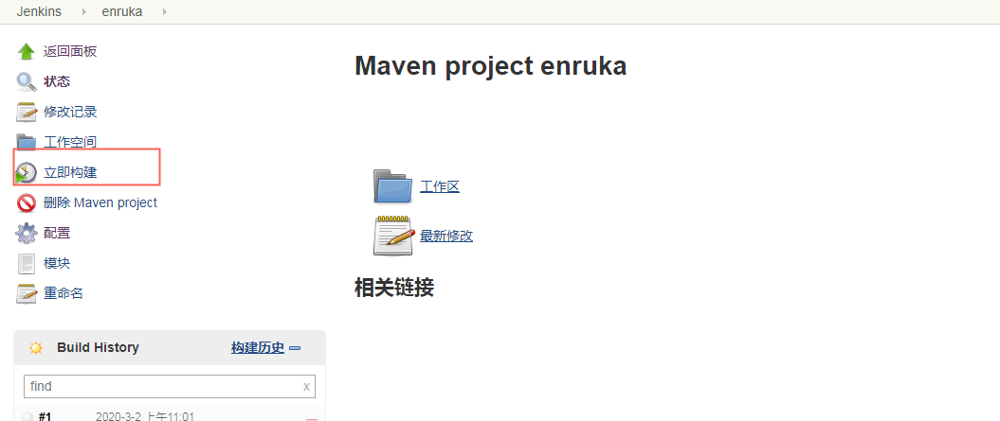

  蓝色球表示构建成功，红色表示构建失败

 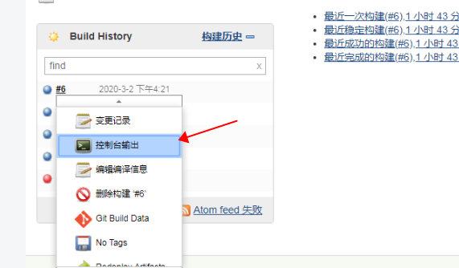

   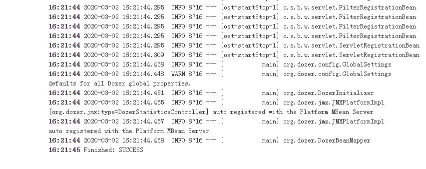

* ## jenkins 将项目发布到远程环境

  有的时候我们需要将打包好的项目发到另一台服务器上，和jenkins不在同一台服务器，需要安装插件publish over ssh

  **1.搜索并安装插件publish over ssh**

  **2.配置发布机器**

     点击系统管理-->系统配置，找到**publish over ssh**，点击新增按钮随后点击高级，输入服务器地址，账户，密码等信息；测试连接并完成

  **3.使用**

   构建后操作选择**send build artifacts over ssh ** 选择需要发布到的机器；并配置传输的几个属性值；

  source file：jar包位置

  remote directory：远程地址

  exec command：执行远程服务器的脚本文件

  

 

